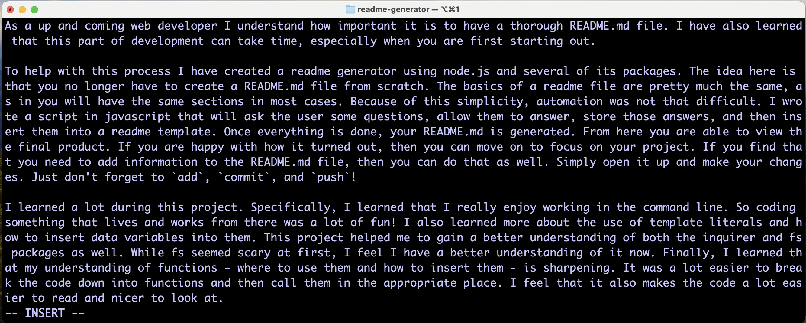

# automated-readme

  
  
  

  ## Description

  As an up and coming web developer I understand how important it is to have a thorough README.md file. I have also learned that this part of development can take time, especially when you are first starting out.

To help with this process I have created a readme generator using node.js and several of its packages. The idea here is that you no longer have to create a README.md file from scratch. The basics of a readme file are pretty much the same, as in you will have the same section in most cases. Because of this simplicity, automation was not that difficult. I wrote a script in javascript that will ask the user some questions, allow them to answer, store those answers, and then insert them into a readme template. Once everything is done, your README.md is generated. From here you are able to view the final product. If you are happy with how it turned out, then you can move on to focus on your project. If you find that you need to add information to the README.md file, then you can do that as well. Simply open it up and make your changes. Just don't forget to `add`, `commit`, and `push`!

I learned a lot during this project. Specifically, I learned that I really enjoy working in the command line. So coding something that lives and works from there was a lot of fun! I also learned more about the use of template literals and how to insert data variables into them. This project also helped me to gain a better understanding of both the inquirer and fs packages as well. While fs seemed scary at first, I feel I have a better understanding of it now. Finally, I learned that my understanding of functions - what to put in them and where to use them - is sharpening. It was a lot easier to break the code down into functions and then call them in the appropriate place. I feel that is also makes the code a lot easier to read and nicer to look at.

  ## Table of Contents

  - [Installation](#installation)
  - [Usage](#usage)
  - [Credits](#credits)
  - [Tests](#tests)
  - [Questions](#questions)
  - [License](#license)

  ## Installation

  To use this automated README.md program you must first do a couple of things.

- First, you'll want to copy this repository to your working space by using `git clone` so that you have it on your computer.
- Make sure your computer has node.js You can check by typing in the following in your command line: `node --version`
	- If node.js is installed you will see something like what is pictured below:
	
	If you do not get a result similar to what is pictured above then you don't have node.js installed. To install it simply go to [Node.js](https://nodejs.org/en).
- Once node is installed on your computer, from your project folder, run the following commands in the command line:
	- `npm init -y` This will initialize the node package and accept the defaults.
	- `npm i inquirer@8.2.4` This will install the inquirer package/dependencies, specifically version 8.2.4.
	- `npm i fs` This will install the fs package used to read and write to files.

After those steps are completed you are ready to begin using the automated README.md generator by running `node index.js`.

  ## Usage

  The project is intended to be used as a quick and easy way to generate README.md files for your github projects. Once you have the project downloaded you start it by running `node index.js` in the command line as seen below:

**Note: Make sure you are in the project that you want your README.md to be created. If you are someplace else then just remember the location of the file so you can move/add it later.**

Once you have started the program you will start to get question prompts as seen below:

**Note: The questions only populate one at a time. You must answer the current question before moving on to the next.**

Some questions will be answered immediately from the command line. Other questions will open your local editor so you can put in detailed information. You will see a prompt before the editor launches as seen below:

**Note: Simply press enter to launch your command line editor.**

Once your editor opens you are able to type your information in. Because you are now in an editor you are able to be as detailed as you want to be. You can create new lines, new paragraphs, code blocks, insert photos, and insert links and anything else you can do in a markdown file. Simply type up your documentation in markdown format just as you would in a README.md file. See below for a quick reference of the editor:

**Note: If your computer uses `vi` for its editor, to start typing press the `i` key on your keyboard to go into `INSERT` mode. Once you have finished typing you can press the `esc` key to get out of `INSERT` mode. From here type `:wq` to save your information and quit the editor. If your computer uses `vim` as the editor there will be commands at the bottom of the screen.**

Once you have finished entering all of your information, and there are no errors, you will receive output statement that your README.md file as been generated as seen below:
 

You can also view a demostration video at the following link:  
https://drive.google.com/file/d/142-x_emGQKmQIbd16rhMQWhbKncBHQL2/view

  ## Credits

Anthony Strickland contributed to this project. You can view more of his work at his [GitHub Repository](https://github.com/AnthonyStrickland?tab=repositories).

I also used the following websites to garner more information on various topics.  

The following websites were used for markdown language:  
https://www.markdownguide.org/  

https://docs.github.com/en/get-started/writing-on-github/getting-started-with-writing-and-formatting-on-github/basic-writing-and-formatting-syntax

The following website was used to get Node.js:

https://nodejs.org/en

The following website was used for Switch statements:

https://www.w3schools.com/js/js_switch.asp

The following websites were used for examples of README.md files:

https://github.com/microsoft/vscode/blob/main/README.md?plain=1  

https://coding-boot-camp.github.io/full-stack/github/professional-readme-guide

The following website was used for Inquirer:

https://javascript.plainenglish.io/how-to-inquirer-js-c10a4e05ef1f  

The following websites were used for FS:

https://www.geeksforgeeks.org/node-js-file-system/?ref=lbp

https://www.w3schools.com/nodejs/nodejs_filesystem.asp

The following website was used to generate the badges:

https://shields.io/

  ## Tests

  There are no Test Instructions for this project.

  ## Questions

  If you would like to know more about this project or to view other projects I have worked on please visit me at [kittykatt210](https://github.com/kittykatt210).

  If you have any questions about this project that aren't answered in the github repository, I can be reached at keperry30@icloud.com.

  ## License
  Copyright (c) Kathryn Perry. All rights reserved.  
  Licensed under the [MIT](https://opensource.org/licenses/MIT) license.
